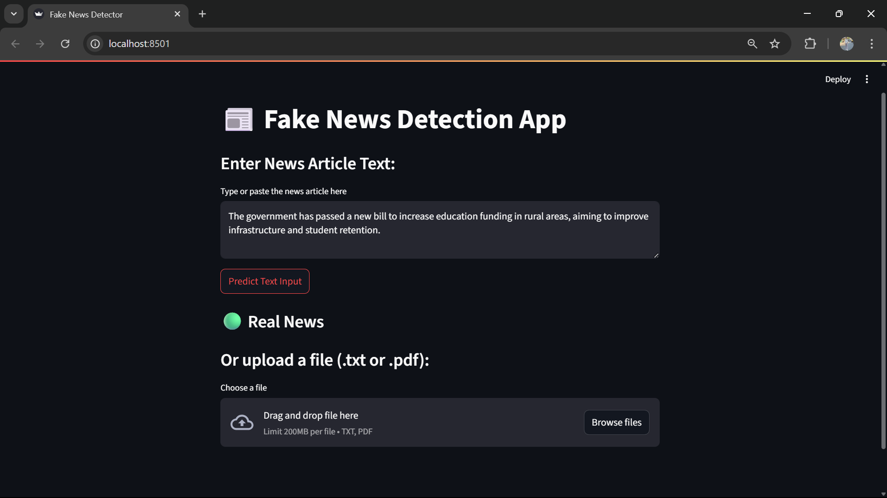

# 📰 Fake News Detection App

This is a simple web app built with **Streamlit** that uses an NLP model to classify whether a news article is **real or fake**.

## 🚀 Features

- Predict news by typing or pasting text
- Upload `.txt` or `.pdf` files for batch prediction
- Shows result instantly using a pre-trained model

## 🧠 Model Details

- Trained on: [Fake and Real News Dataset (Kaggle)](https://www.kaggle.com/clmentbisaillon/fake-and-real-news-dataset)
- Vectorization: TF-IDF
- Model: Logistic Regression

## 📁 Dataset

Due to GitHub's file size limit, the dataset is not included.  
➡️ **Download from Kaggle**: https://www.kaggle.com/clmentbisaillon/fake-and-real-news-dataset  
Place `Fake.csv` and `True.csv` inside the `data/` folder.

## 📷 Screenshot



## 🚀 How to Run Locally


```bash
pip install -r requirements.txt
streamlit run app.py

```

✨ *Made with ❤️ by Ashwin*

